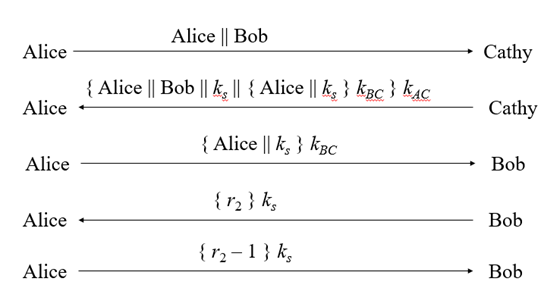
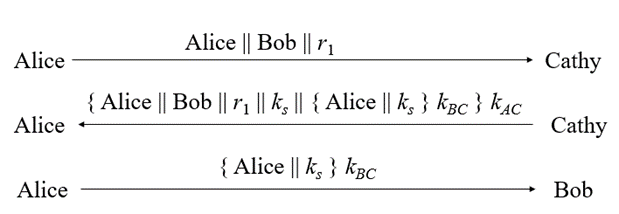
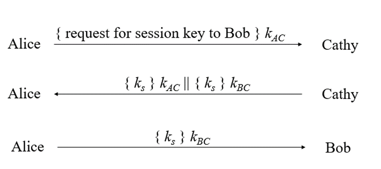
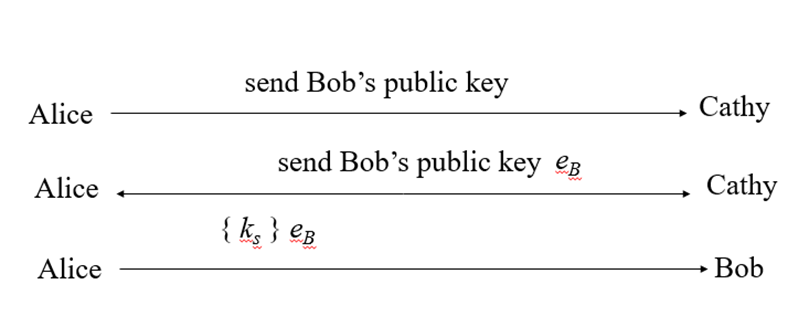

EX: Why is it necessary to use session keys?

Sol: 

- Avoid important keys being used multiple times, leading to a high possibility of key disclosure

- Helps make calculations simple and fast because encryption with session keys is symmetric encryption.

- Session keys change continuously, so if one session's key is revealed, it will not affect other sessions

Ex: Meaning of $r_1$ in Needham-Schroeder protocol. Presents details of attack with Needham-Shroeder protocol in the absence of $r_1$ ?

Sol: 

- $r_1$ is to check the novelty of the 2nd packet, thereby preventing the attack from reusing the 2nd packet and impersonating Cathy.

- The protocol without $r_1$ would be as follows:

Suppose that at some point in the past, for example the year 2000, Alice and Bob used the above protocol to exchange session key $k_s$

At that time, the Eve attacker had not yet broken the $k_s$ key, so the transaction was safe at that time. However, some time later, for example in 2016, the Eve attacker somehow obtained the $k_s$ key and retrieved all the packets that were exchanged in the 2000 session.

By 2017, Alice and Bob used the above protocol to exchange keys. At this time, Eve will impersonate Cathy to trick Alice and Bob as follows: Eve blocks packet 1 from reaching Cathy, Eve then impersonates Cathy and resends packet number 2 that was used in 2000. Alice received a packet sent from Eve but thought it was a packet sent from Cathy, because this packet was encrypted with Alice and Cathy's secret key. After that, Alice and Bob will exchange packets 3,4,5 according to the correct protocol. As a result, Alice and Bob will reuse the key $k_s$ used in 2000. The danger is that Eve already knows this key. And so Eve can hear the entire exchange between Alice, Bob or impersonate Alice and Bob.

Ex: Role of steps 4.5 in the Needham-Shroeder protocol. Presents details of the attack with the Needham-Shroeder protocol without these two steps.

Sol: 

The protocol without two steps 4.5 will be as follows:

With a protocol like this, an attacker could attack as follows: Suppose at some point in the past, for example the year 2000, Alice and Bob used the above protocol to exchange key $k_s$. Eve's attacker somehow captured all the packets sent during that conversation. Because Eve wanted to tease Bob, then, for example in 2016, she suddenly sent the third packet in the above protocol to Bob. According to the protocol, Bob will believe this is a packet sent from Alice. Therefore, bob will use key $k_s$ to exchange information with Eve (because he thinks Eve is Alice). Because Eve does not know the key $k_s$, she cannot decrypt the packet, but Eve keeps replaying the packets that Alice sent to Bob in the 2000 transaction session. Because the 2000 packets are all encrypted with $k_s$, when Bob receives them, Bob decodes them and they are still meaningful messages. So Bob will waste time talking to Eve in vain.

Ex: What weaknesses does the Needham-Shroeder protocol have and how can it be overcome? 

Sol: 

+ In step 3, Bob does not know who he is talking to. 

+ An attacker can easily attack by resending packets with a scenario similar to question 3 

+ An attacker, if he knows a session key $k_s$ has been used in the past, can spoof Cathy as in verse 2. 

Solution: refer to Needham-schoeder protocol. Use random numbers to check packet novelty.

Ex: Suppose A and B have the same party C. A and B want to establish a session key ks through C with the following protocol

Please tell us what weaknesses this protocol has and how it can be overcome

Sol: 

Fix the weakness: Suppose Alice and Bob both know Cathy's public key -> add Cathy's digital signature to the packets.

Ex: Suppose A and B do not know each other's public keys. However, A and B have the same trusted third party, C. A and B want to obtain the other's public key through C with the following protocol:

Please tell us what weaknesses this protocol has and how it can be overcome?

